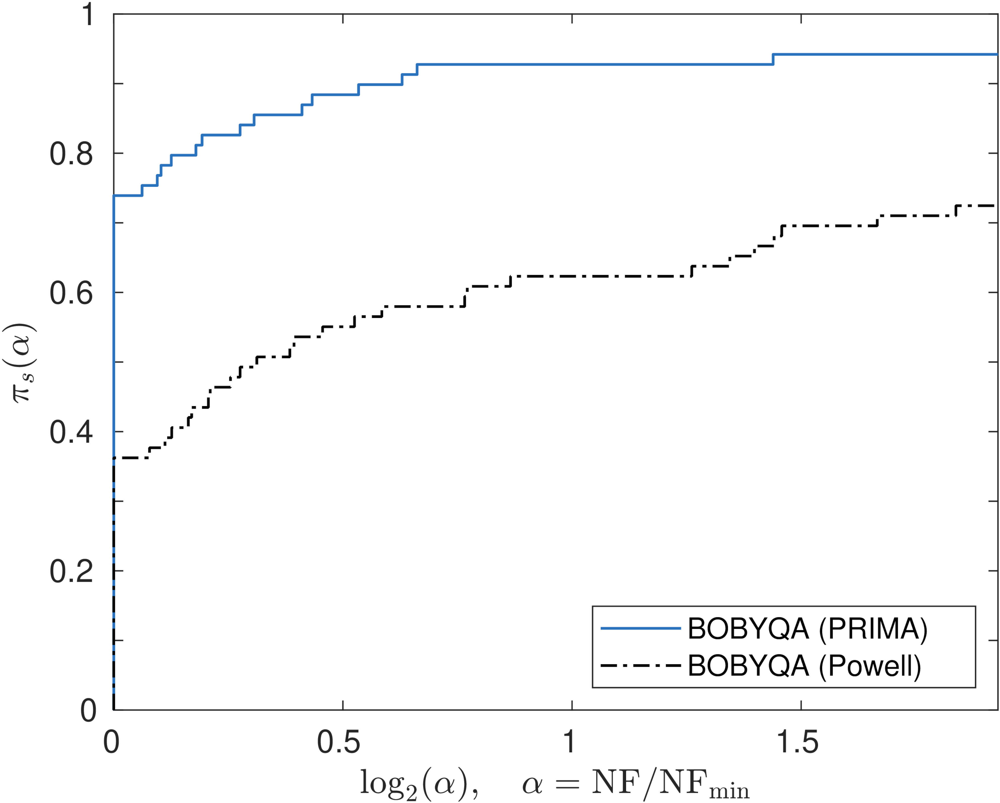
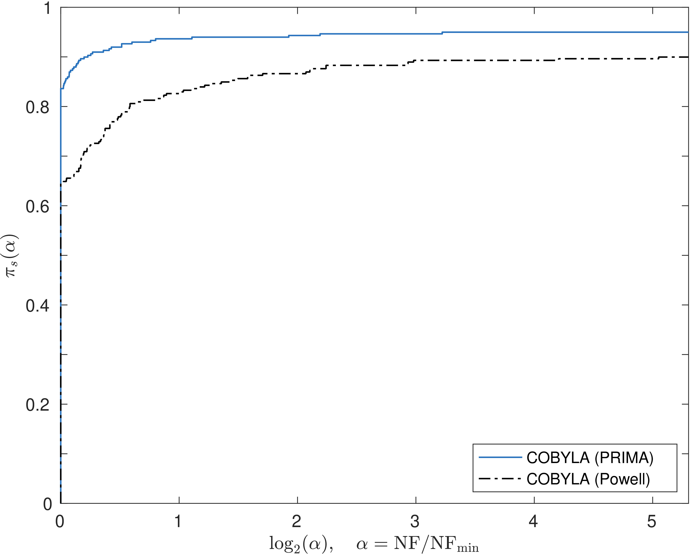
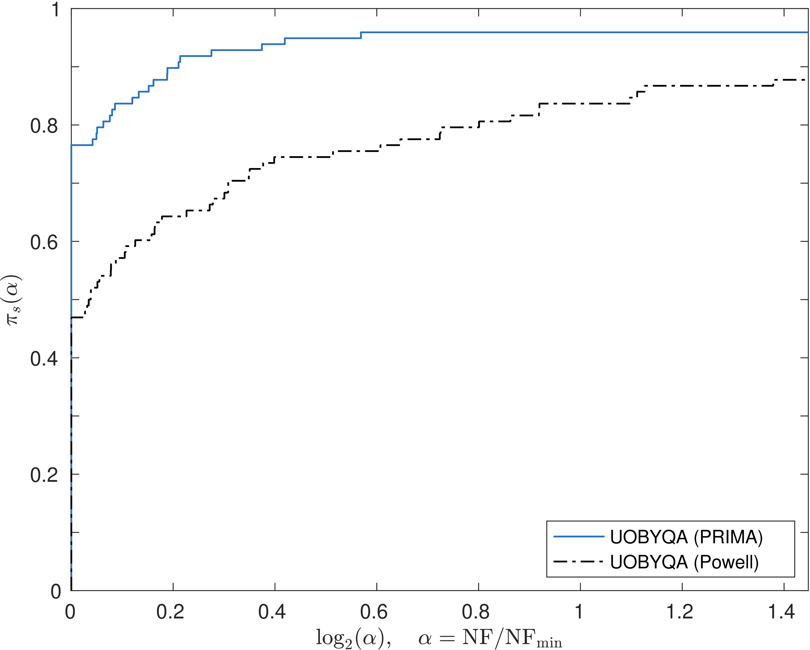

## PRIMA: Reference Implementation for Powell's methods with Modernization and Amelioration

Dedicated to late Professor [**M. J. D. Powell**](https://www.zhangzk.net/powell.html) FRS (1936--2015)

- [What](#what)
- [Why](#why)
- [How](#how)
- [Current status](#current-status)
- [Bug fixes](#bug-fixes)
- [Improvements](#improvements)
- [A "fun" fact](#a-fun-fact)

### What

PRIMA provides the reference implementation for Powell's derivative-free optimization methods,
namely COBYLA, UOBYQA, NEWUOA, BOBYQA, and LINCOA. The "P" in the name stands for
[**P**owell](https://www.zhangzk.net/powell.html), and "RIMA" is an acronym for
"**R**eference **I**mplementation with **M**odernization and **A**melioration".

PRIMA is part of a research project funded by the
[Hong Kong Research Grants Council](https://www.ugc.edu.hk/eng/rgc) and
the [Department of Applied Mathematics](https://www.polyu.edu.hk/ama) (AMA) at the
[Hong Kong Polytechnic University](https://www.polyu.edu.hk) (PolyU).
It is still **under intensive development**, and there is no release yet. If you want to use the
above-mentioned methods, see the [website](https://www.pdfo.net)
and [repository](https://github.com/pdfo/pdfo) of [PDFO](https://www.pdfo.net) instead
([Py-BOBYQA](https://numericalalgorithmsgroup.github.io/pybobyqa/) is also highly recommended if
you intend to solve bound-constrained problems).

PRIMA was initiated by [Zaikun Zhang](https://www.zhangzk.net) in July 2020, based on
the [PDFO](https://www.pdfo.net) package by [Tom M. Ragonneau](https://tomragonneau.com/) and
Zaikun Zhang.

### Why

Professor Powell carefully implemented his derivative-free optimization methods into publicly available solvers,
which are genuine masterpieces. They are widely used by engineers and scientists (for instance,
see the citations of [COBYLA](https://scholar.google.com/scholar?hl=en&as_sdt=0%2C5&q=A+Direct+Search+Optimization+Method+That+Models+the+Objective+and+Constraint+Functions+by+Linear+Interpolation&btnG=)
and [BOBYQA](https://scholar.google.com/scholar?hl=en&as_sdt=0%2C5&q=The+BOBYQA+algorithm+for+bound+constrained+optimization+without+derivatives&btnG=)).

However, Professor Powell's
implementation is in [Fortran 77](https://github.com/equipez/PRIMA/tree/master/fortran/original)
and the code is nontrivial to understand or maintain, let alone to
extend. This becomes an obstacle for many practitioners to exploit these solvers in their
applications and hinders researchers from exploring the wealth left by Professor Powell to the
community.

Before he passed, Professor Powell had asked me to maintain his solvers. This is an honorable
mission, and I have the responsibility to make the solvers more accessible.
PRIMA is a project somehow similar to the translation, interpretation, and annotation of
Euclid’s *Elements*.
It will make Powell's solvers easily accessible to everyone, not only the experts.
Few people remember [who translated *Elements*](https://en.wikipedia.org/wiki/Euclid%27s_Elements#Translations),
but it is a job that must be done.

PRIMA aims to provide the reference implementation of Powell's methods in modern languages,
including [**modern** Fortran](https://fortran-lang.org) (F2008 or newer), MATLAB, Python, C++, and
probably Julia and R. It will be a faithful implementation, in the sense that the code will be
mathematically equivalent to Powell’s, except for the
[bug fixes](#bug-fixes) and [improvements](#improvements) made intentionally.

The focus is to implement these methods in a **structured** and **modularized** way so that they
are easily **understandable**, **maintainable**, **extendable**,
**fault tolerant**, and **future-proof**.
The code will **have no GOTO** (of course)
and will **use matrix-vector procedures instead of loops** whenever possible.
In doing so, PRIMA codes the algorithms **in a way that we would present them on a blackboard**.

There do exist "translations" of Powell's Fortran 77 code into other languages. For example,
[NLopt](https://github.com/stevengj/nlopt) contains a C version of COBYLA, NEWUOA, and BOBYQA,
but the C code in NLopt is translated from the Fortran 77 code straightforwardly, if
not automatically by [f2c](https://netlib.org/f2c/f2c.pdf), and hence inherits the style, structure,
and probably [bugs](#bug-fixes) of the original Fortran 77 implementation.
Note, however, that
[Py-BOBYQA](https://numericalalgorithmsgroup.github.io/pybobyqa/) is a **true translation** of BOBYQA
to Python, with significant improvements.

### How

The mission of PRIMA is nontrivial due to the delicacy of Powell's algorithms and the unique style
of his code. To ensure the faithfulness of PRIMA,
the **modern** Fortran version was started by refactoring Powell's code into the free form via a small
[MATLAB tool](https://github.com/equipez/PRIMA/blob/master/matlab/setup_tools/freeform.m).
However, such refactored code is far from what we want, because it inherits completely
the structure and style of Powell's code except for the layout. Extensive modifications are needed
to reorganize (indeed, to **rewrite**) the code. To maintain the faithfulness and quality of our
implementation, extensive tests are conducted after each and every tiny modification, the test
problems coming from the [CUTEst set](https://github.com/ralna/CUTEst). The tests do not only verify
the faithfulness of our implementation, but also check that **the solvers behave properly even if they
are invoked with improper inputs or encounter failures of function evaluations**.

The tests are automated by
[GitHub Actions](https://docs.github.com/en/actions). As of November 2022, more than
30,000 "workflows" have been successfully run by GitHub Actions
(see https://github.com/equipez/gitpersonal/actions and https://github.com/equipez/PRIMA/actions).
Normally, each workflow consists of \~ 5
([sometimes more than 100](https://github.com/equipez/PRIMA/actions/workflows/test_gfortran_gO3.yml))
**randomized** tests that are conducted in parallel,
each test taking from tens of minutes to several hours (the maximum
is 6 hours, after which the workflow will be canceled automatically). In other words,
PRIMA has been verified by more than $10^5$ hours (or more than $10$ years) of randomized tests.

### Current status

After almost **three** years of intensive coding, **the
[modern Fortran version](https://github.com/equipez/PRIMA/tree/master/fortran) of
PRIMA has been finished by December 2022.** An [interface](./matlab/interfaces)
is also provided for [using the Fortran implementation under MATLAB](./README_mat.txt). Interfaces for other languages will
be available later.

Given the **modern** Fortran version, the implementation in other languages
becomes **much easier**, because we now have a structured and modularized implementation as a reference.
As an illustration, we have implemented a [MATLAB version of NEWUOA](./matlab/interfaces/+newuoa_mat/)
based on an earlier version of the **modern** Fortran code (with the help of Mr. Galann Pennec).
The MATLAB code was obtained from the **modern** Fortran code straightforwardly, and indeed, **automatically**.

------

### Bug fixes

PRIMA has fixed the some **serious** issues in the **original Fortran 77 implementation** of Powell's methods.
Note that all the issues are problems in the Fortran 77 code rather than flaws in the algorithms.

<!---[NLopt.jl](https://github.com/JuliaOpt/NLopt.jl), -->
The examples given below are bugs or requests sent to [SciPy](https://github.com/scipy/scipy),
[NLopt](https://github.com/stevengj/nlopt),
[nloptr](https://github.com/astamm/nloptr),
[OpenTURNS](https://github.com/openturns/openturns),
etc., which are reputable packages that wrap/interface the **original Fortran 77 implementation**
of Powell's solver. Inevitably, they suffer from the bugs in the Fortran 77 code.

- The solvers may **crash** with segmentation faults due to uninitialized variables that are used as indices.

     - [Fix all uninitialized variable warnings #134](https://github.com/stevengj/nlopt/issues/134)

	 - [BOBYQA uninitialised variables in rare cases #133](https://github.com/stevengj/nlopt/issues/133)

	 - [Use of uninitialized variable in BOBYQA altmov #36](https://github.com/stevengj/nlopt/issues/36)

- The solvers may get **stuck** in infinite loops.

     - [optimize: COBYLA hangs / infinite loop #8998](https://github.com/scipy/scipy/issues/8998)
     - [BUG: Scipy.optimize / COBYLA hangs on some CPUs #15527](https://github.com/scipy/scipy/issues/15527)

	 - [COBYLA freezes (though maxeval and maxtime are given) #370](https://github.com/stevengj/nlopt/issues/370)

	 - [COBYLA hangs #118](https://github.com/stevengj/nlopt/issues/118)

	 - [NEWUOA_BOUND stuck in infinite loop inside MMA #117](https://github.com/stevengj/nlopt/issues/117)

     - [Cobyla freezes in 0T1.16rc1 #1651](https://github.com/openturns/openturns/issues/1651)

     - [Optimization freezes #25](https://github.com/astamm/nloptr/issues/25)

     - [BOBYQA gets stuck in infinite loop. #7](https://github.com/cureos/csnumerics/issues/7)

     - [Algorithm turns into infinite loop and never finishes #3](https://github.com/xypron/jcobyla/issues/3)

- COBYLA may **not return the best point** that is evaluated; sometimes, the returned point can have a
large constraint violation even though the starting point is feasible.

	 - [nlopt COBYLA optimizer gives unexpected output #182](https://github.com/stevengj/nlopt/issues/182)

	 - [Last Result Returned Not Optimized Result #110](https://github.com/stevengj/nlopt/issues/110)

	 - [COBYLA returns last evaluated function which might not be minimum #57](https://github.com/stevengj/nlopt/issues/57)

     - [Successful termination when constraints violated #1](https://github.com/cureos/jcobyla/issues/1)

<!---
- Thread-safety
    - [scipy.optimize.minimize(method='COBYLA') not threadsafe #9658](https://github.com/scipy/scipy/issues/9658)

    - [BUG: Make cobyla threadsafe #3](https://github.com/sturlamolden/scipy/pull/3)
-->

------

### Improvements

Due to the improvements introduced into the new implementation, PRIMA outperforms Powell's
original code in terms of the **number of function evaluations**, which is the standard performance
indicator in derivative-free optimization.
Below are the [performance profiles](https://arxiv.org/pdf/cs/0102001.pdf)
of the PRIMA solvers compared with Powell's implementation, the convergence tolerance being $\tau = 10^{-8}$.
Roughly speaking, performance profiles plot the percentage of test problems solved against the budget,
which is measured relative to the cost of the most efficient solver in the comparison.
A **higher** curve indicates a **better** solver.
See [Benchmarking Derivative-Free Optimization Algorithms](https://www.mcs.anl.gov/~wild/dfo/benchmarking)
([J. J. Moré](https://www.anl.gov/profile/jorge-j-more) and [S. M. Wild](https://www.anl.gov/profile/stefan-m-wild))
for more information.

- NEWUOA on unconstrained CUTEst problems of at most 50 variables

- BOBYQA on bound-constrained CUTEst problems of at most 50 variables

- LINCOA on linearly constrained CUTEst problems of at most 50 variables and 5000 constraints

- COBYLA on nonlinearly constrained CUTEst problems of at most 20 variables and 2000 constraints

- UOBYQA on unconstrained CUTEst problems of at most 20 variables

------

### A "fun" fact

In the past years, while working on PRIMA, I have spotted a dozen of [bugs in reputable Fortran compilers](https://github.com/zequipe/test_compiler)
and two [bugs in MATLAB](https://github.com/zequipe/test_matlab). Each of them represents days of **bitter** debugging, which finally led to the conclusion
that it was not a problem in my code but a flaw in the Fortran compilers or in MATLAB. From a very unusual angle, this reflects how intensive
the coding has been.

The bitterness behind this "fun" fact is exactly why I work on PRIMA: I hope that all
the frustrations that I have experienced will not happen to any user of Powell's methods anymore.
