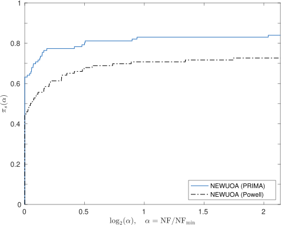
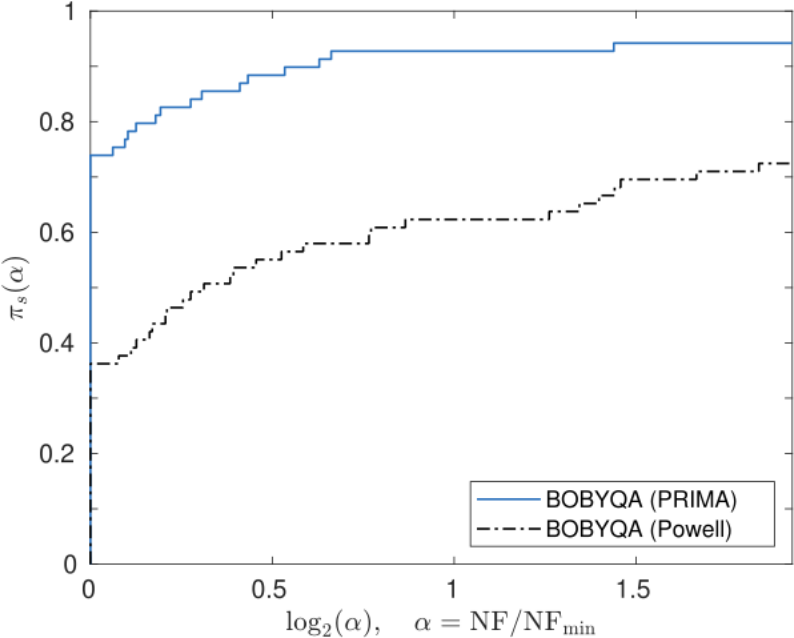
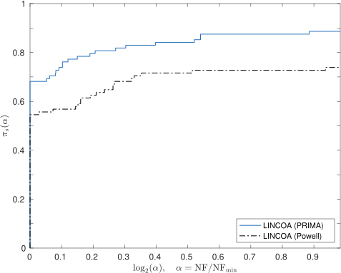
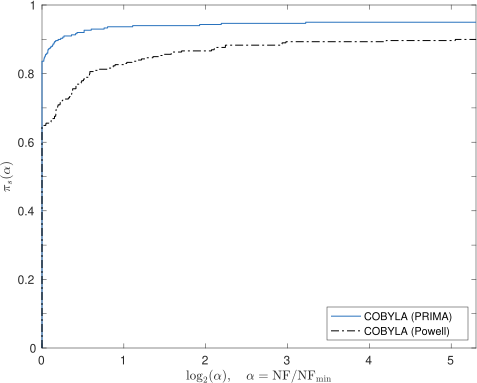
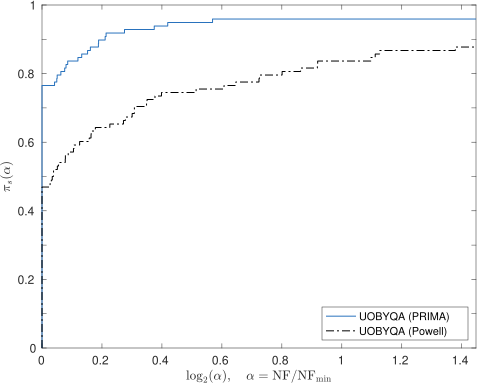

## PRIMA: Reference Implementation for Powell's methods with Modernization and Amelioration

Dedicated to late Professor [**M. J. D. Powell**](https://www.zhangzk.net/powell.html) FRS (1936--2015)

### What

PRIMA provides the reference implementation for Powell's derivative-free optimization methods,
namely COBYLA, UOBYQA, NEWUOA, BOBYQA, and LINCOA.

PRIMA is part of a research project funded by the
[Hong Kong Research Grants Council](https://www.ugc.edu.hk/eng/rgc) and
the [Hong Kong Polytechnic University](https://www.polyu.edu.hk) (PolyU).
It is still **under intensive development**, and there is no release yet. If you want to use the
above-mentioned methods, see the [website](https://www.pdfo.net)
and [repository](https://github.com/pdfo/pdfo) of PDFO instead.

### Why

The goal of PRIMA is to provide the reference implementation of Powell's methods in modern languages,
including [**modern** Fortran](https://fortran-lang.org) (F2003 or newer), MATLAB, Python, C++, and
probably Julia and R. It will be a faithful implementation, in the sense that the code will be
mathematically equivalent to Powell’s, except for the
[bug fixes](#bug-fixes) and [improvements](#improvements) that we make intentionally.

The focus is to implement these methods in a **structured** and **modularized** way so that they
are **readable**, **maintainable**, and **extendable**. The code will have no GOTO (of course)
and will use matrix-vector procedures instead of loops whenever possible.

### How

The mission of PRIMA is nontrivial due to the delicacy of Powell's algorithms and the unique style
of his code. To ensure the faithfulness of PRIMA,
we started the **modern** Fortran version by refactoring Powell's code into the free form via a small
[MATLAB tool](https://github.com/equipez/PRIMA/blob/master/matlab/setup_tools/freeform.m) written
by ourselves. However, such refactored code is far from what we want, because it inherits completely
the structure and style of Powell's code except for the layout. Extensive modifications are needed
to reorganize (indeed, to **rewrite**) the code. To maintain the faithfulness and quality of our
implementation, intensive tests are conducted after each and every tiny modification, the test
problems coming from the [CUTEst set](https://github.com/ralna/CUTEst). The tests do not only verify
the faithfulness of our implementation, but also check that **the solvers behave properly even if they
are invoked with improper inputs or encounter failures of function evaluations**.

The tests are automated by
[GitHub Actions](https://docs.github.com/en/actions). As of October 2022, more than
25,000 "workflows" have been successfully run by GitHub Actions
(see https://github.com/equipez/gitpersonal/actions and https://github.com/equipez/PRIMA/actions).
Normally, each workflow consists of \~ 5 **randomized** tests
that are conducted in parallel, each test taking from tens of minutes to several hours (the maximum
is 6 hours, after which the workflow will be canceled automatically). In other words, PRIMA
has been verified by more than $10^5$ hours (or more than $10$ years) of randomized tests.

As of October 2022, we have almost finished the **modern** Fortran version of PRIMA. More specifically,
the implementation of [COBYLA](https://github.com/equipez/PRIMA/tree/master/fsrc/cobyla)
and [NEWUOA](https://github.com/equipez/PRIMA/tree/master/fsrc/newuoa) is complete, while
[UOBYQA](https://github.com/equipez/PRIMA/tree/master/fsrc/uobyqa),
[BOBYQA](https://github.com/equipez/PRIMA/tree/master/fsrc/bobyqa),
and [LINCOA](https://github.com/equipez/PRIMA/tree/master/fsrc/lincoa) have been implemented in
**modern** Fortran without any GOTO.
A [MATLAB interface](https://github.com/equipez/PRIMA/blob/master/setup.m) is also provided for
using the Fortran implementation under MATLAB.
Once the **modern** Fortran version is finished, the implementation in other languages will become much
easier, because we will then have a structured and modularized implementation as a reference.

------

### Bug fixes

PRIMA has fixed the following known issues in the **old Fortran 77 implementation** of Powell's methods.

Note that all the issues are problems in the Fortran 77 code rather than flaws in the algorithms.
The examples given below are bugs or requests sent to [NLopt](https://github.com/stevengj/nlopt), a
package providing a C version of COBYLA, NEWUOA, and BOBYQA based on the **old Fortran 77
implementation**. The C code in NLopt is translated from the Fortran 77 code straightforwardly, if
not automatically by [f2c](https://netlib.org/f2c/f2c.pdf), and hence inherits the style, structure,
and probably bugs of the old Fortran 77 implementation.

- The solvers may crash with segmentation faults due to uninitialized variables that are used as indices.

     - [Fix all uninitialized variable warnings #134](https://github.com/stevengj/nlopt/issues/134)

	 - [BOBYQA uninitialised variables in rare cases #133](https://github.com/stevengj/nlopt/issues/133)

	 - [Use of uninitialized variable in BOBYQA altmov #36](https://github.com/stevengj/nlopt/issues/36)

- The solvers may get stuck in infinite loops.

	 - [COBYLA freezes (though maxeval and maxtime are given) #370](https://github.com/stevengj/nlopt/issues/370)

	 - [COBYLA hangs #118](https://github.com/stevengj/nlopt/issues/118)

	 - [NEWUOA_BOUND stuck in infinite loop inside MMA #117](https://github.com/stevengj/nlopt/issues/117)

- COBYLA may not return the best point that is evaluated; sometimes, the returned point can have a
large constraint violation even though the starting point is feasible.

	 - [nlopt COBYLA optimizer gives unexpected output #182](https://github.com/stevengj/nlopt/issues/182)

	 - [Last Result Returned Not Optimized Result #110](https://github.com/stevengj/nlopt/issues/110)

	 - [COBYLA returns last evaluated function which might not be minimum #57](https://github.com/stevengj/nlopt/issues/57)

------

### Improvements

Due to the improvements we have introduced into the new implementation, PRIMA outperforms Powell's
original code in terms of the **number of function evaluations**, which is the normal performance indicator
in derivative-free optimization.
Below are the [performance profiles](https://arxiv.org/pdf/cs/0102001.pdf)
of the PRIMA solvers compared with Powell's implementation, the convergence tolerance being $\tau = 10^{-8}$.

- NEWUOA on unconstrained CUTEst problems of at most 50 variables

- BOBYQA on bound-constrained CUTEst problems of at most 50 variables

- LINCOA on linearly constrained CUTEst problems of at most 50 variables and 5000 constraints

- COBYLA on nonlinearly constrained CUTEst problems of at most 20 variables and 2000 constraints

- UOBYQA on unconstrained CUTEst problems of at most 20 variables

